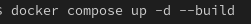
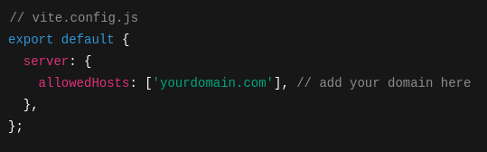
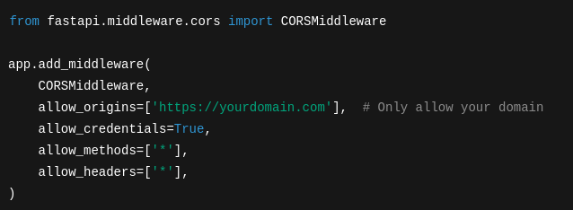

# Gym Tracking App

A simple gym tracking app that can be installed on your phone through a browser as a PWA

  

## Build
Building this project requires docker compose. At the root of the project, run: 
 

 
You can now visit http://localhost:3003

## Hosting

Adding domains to the compose file is on the to do list, but for now edit frontend/vite.config.ts and add allowedHosts: ['example.com'] directly under the server property.
 

 
Then, navigate to backend/server/main.py and change "allow_origins=[*]" to "allow_origins=['https://example.com']".
 

 

## Features

- Add exercises
- Add Splits
- Log a workout and view previous ones

## To do list
- Allow hosting domain to be specified through docker
- Import existing data
- Search functionality when searching for an exercise
- Stats Page
- Settings Page
- Caching through service workers
- Delete exercises and splits

